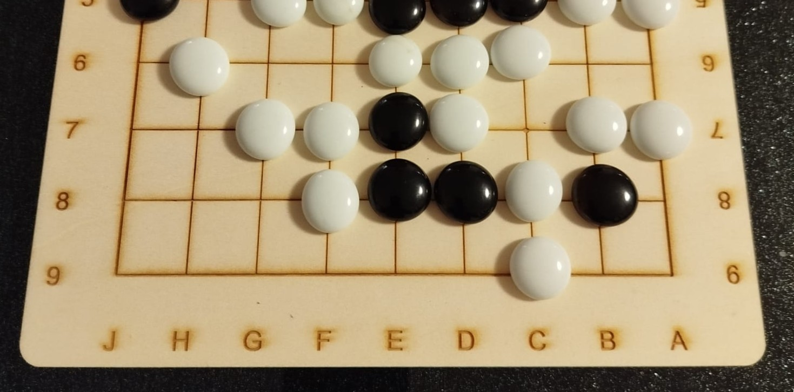

# pygoban


[](https://github.com/StefanHauer/pygoban/LICENSE.txt)


The Python library *pygoban* is intended for creating [scalable vector graphics](https://en.wikipedia.org/wiki/SVG) files of [Go boards](https://en.wikipedia.org/wiki/Go_(game)). You can then use these files to either print them out on paper, or better yet, etch and cut them on the material of your choice using a laser cutter.

With this library you can easily create your own boards with
* custom grids, allowing for any number of grid lines, and even rectangular grids,
* custom grid spacing tailored to your stone sizes,
* custom star point marker positions,
* and different annotation styles for the grid lines.

## Installation

Download [this repository](https://pip.pypa.io/en/stable/), change the directory to that folder and install via pip:

```bash
cd C:\downloaded\folder
pip install .
```

## Usage


### Basic usage

To create your svg file, specify the size of the (square) grid as an integer. While he most common boards are 9 $\times$ 9, 13 $\times$ 13, or 19 $\times$ 19, you can use any number greater than 1.

```python
from pygoban import GobanMaker

g = GobanMaker(size=9)
g.create_svg_file(r"C:\Path\To\File\MyGoban.svg")
```


### Custom board sizes

Instead of specifying the size as an integer, you can also use a tuple. So instead of *size=9*, you could also specify *size=(9,9)* and get the same output. So while usually people play on square grids, if you want to create rectangular grids, you can do this too. Would anyone ever play on a board like this - most likely not, but if you ever do, let me know!

```python
g = GobanMaker(size=(8,5))
g.create_svg_file(r"C:\Path\To\File\MyGoban.svg")
```


### Annotation

Most boards do not label the horizontal and vertical grids, but if you wish to, you can specify to annotate them either with Arabic numerals, Chinese numerals, or Latin letters.

```python
g = GobanMaker(
    size=(9,9),
    border_spacing=(28.,28.),
    x_annotation="latin_letters",
    y_annotation="arabic_numerals",
    font_size=8,
    font_face="Microsoft YaHei"
)
g.create_svg_file(r"C:\Path\To\File\MyGoban.svg")
```


When you want to use Chinese numerals, make sure that the font face that you have selected can display Chinese characters. To show all fonts that are installed on your computer, you can use the following command:

```bash
fc-list : family
```

### Fine tuning the board

Out of the box, *pygoban* uses standard dimensions for the thickness of the grid lines and the spacing between grids. However, you can fine-tune the board with a lot of attributes which are listed here:

* **size : tuple of two int, default=(9,9)**<br>
    Number of vertical and horizontal lines that make up the grid.
* **line_widths tuple of two float, default=(1.,2.)**<br>
    Line widths of the grid (thinner lines), and the border of the grid (thicker lines), both in mm.
* **line_spacing : tuple of two float, default=(22., 23.7)**<br>
    Spacing between vertical and horizontal lines of the grid in mm.
* **star_point_diameter : float, default=4**<br>
    Diameter of the star point markers in mm.
* **star_point_pos : list of tuples, default='auto'**<br>
    Grid points where to put star point markers. If 'auto', will try to put them in the 3 $\times$ 3 corners
    on the center of the sides, and in the center, where possible.
* **x_annotation : [None, 'arabic_numerals', 'chinese_numerals', 'latin_letters'], default=None**<br>
    Annotation style for the vertical grid lines.
* **y_annotation : [None, 'arabic_numerals', 'chinese_numerals', 'latin_letters'], default=None**<br>
    Annotation style for the horizontal grid lines.
* **font_face : str, default='Microsoft YaHei'**<br>
    Font face to use for the annotation of the vertical and horizontal grid lines.
* **font_size : float, default=8**<br>
    Font size to use for the annotation of the vertical and horizontal grid lines.

## Support and Contribution

If you find any bugs, have suggestions for new features, or want to implement features yourself, let me know!

## License

This library has been published under an MIT license. Do with this code what you want, but most importantly, use it to enjoy the beautiful game of Go.
